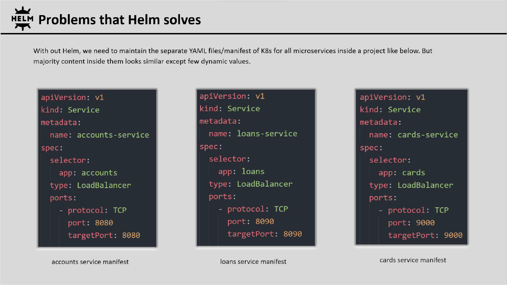
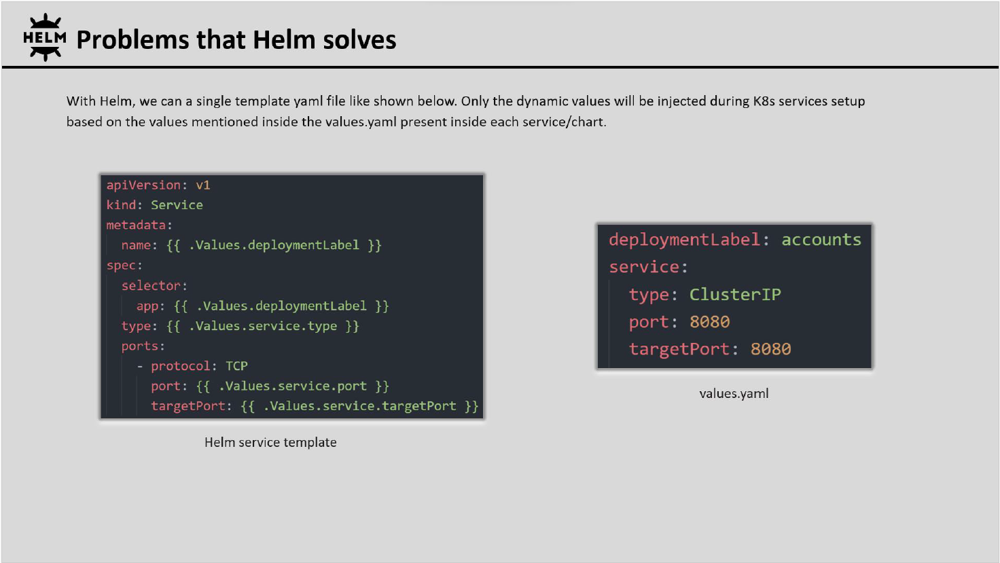
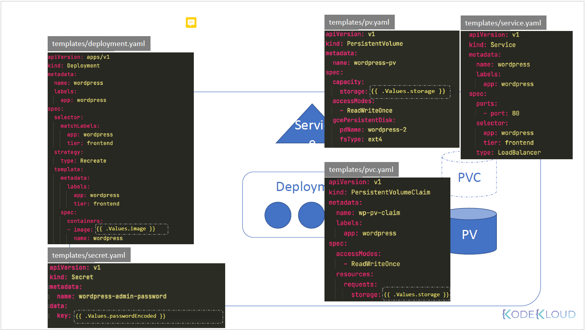
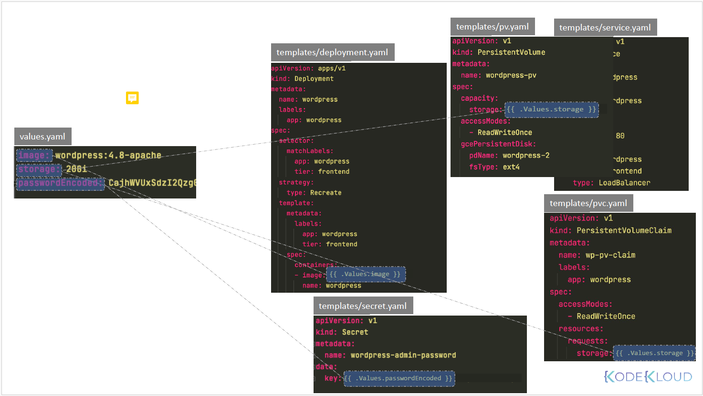
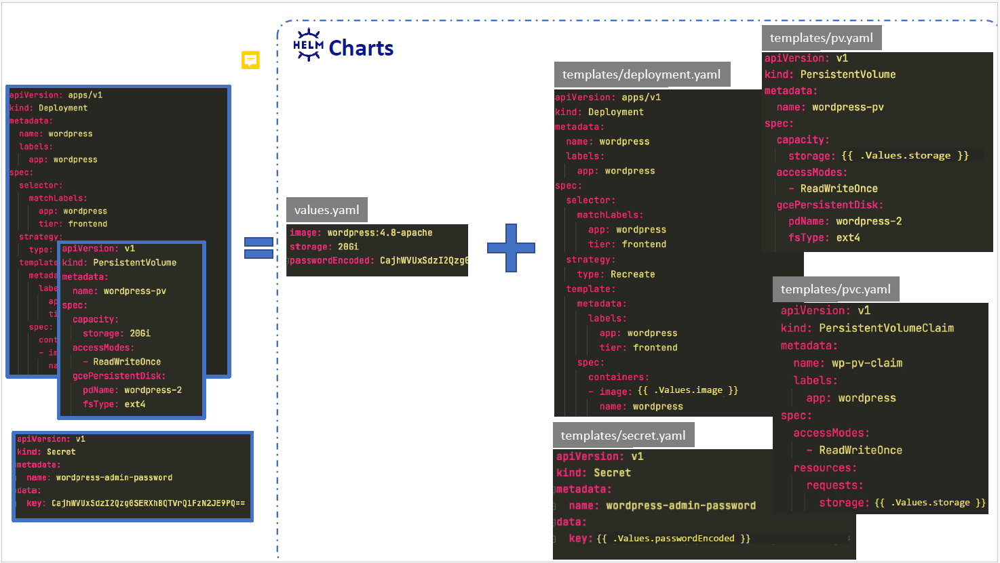
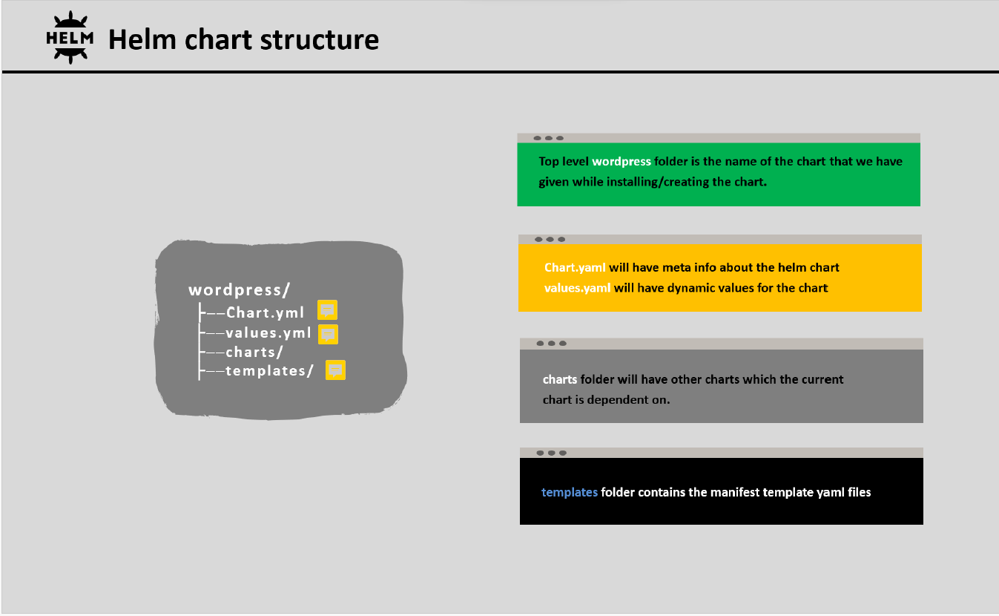

## HELM

### What is HELM?

Helm is renowned as the ``package manager of Kubernetes``, aiming to enhance the management of Kubernetes
projects by offering users a more efficient approach to handling the multitude of YAML files involved.

Without Helm, we need to maintain all K8s manifest files for Deployment, Service, ConfigMap, Secret etc. for each
microservice, and DevOPS team members has to manually apply or delete all the Kubernetes YAML manifest files
using kubectl.

### Problems that HELM solves

- Helm supports packaging of YAML files : With the help of Helm, we can package all of the YAML manifest files
that belongs into an application into a Chart. The same can be distributed into public or private repositories.

- Helm supports easier installation : With the help of Helm, we can set up / upgrade / rollback / remove entire
microservices applications into k8s cluster with just 1 command. No need to manually run kubectl apply/create command
for each manifest file.

- Helm supports release/version management : Helm automatically maintains the version history of the installed
manifests. Due to that rollback of entire K8s cluster to the previous working state is just a single command away.







### Helm Concepts

Let us now understand the helm concepts.



Let us now see how Helm help us using charts. 
Here are the yaml files that we plan to use. 
We have the deployment.yaml, secret.yaml, pv.yaml, pvc.yaml and the service.yaml. 
Now each with its own definition to deploy a component of the WordPress application on Kubernetes. 
Now we know that some of these have values that might change between different environments.

Well, users may prefer to use a different version of the image that is used to deploy the application or 
different size of disc. And of course, the application admin password is going to be different as well.
So the first step is to convert these files into templates where these values become variables. 
The two curly braces indicates that these are variables and that the values specified within our variable names
which will be used to fetch these values from another place.

So what is that other place where these values are fetched from?



These values are stored in a file named values.yaml. These, this file has the image storage and password encoded variables defined with the values We want these to have.

This way anyone who wants to deploy this application can customize their deployment by simply changing the values from the single file called values.yaml.



So a combination of templates plus values.yaml gives us the final version of definition 
files that can be used to deploy the application on the Kubernetes cluster.

Together the templates and the values file forms a helm chart.



### Helm Commands

- To search a already existing chart in artifact.io repo
    ```
    helm search hub wordpress    
    ```

- To add a different helm repo
  ```
  helm repo add bitnami https://charts.bitnami.com/bitnami    
  ```

- To search a chart inside bitnami repo
  ```
  helm search repo wordpress  
  ```
  
- To list added repos
  ```
  helm repo list
  ```
  
- To create a blank chart with a name dekanbank. Inside dekanbank folder, we can see charts.yaml, values.yaml, charts folder and template folder.
  ```
  helm create dekanbank
  ```

- To reconstruct a chart's dependencies. This will compile the chart, and also it will try to compile all dependent helm charts and place them inside the chart folder.

  ```
  helm dependencies build
  ```

- To install the chart on your cluster
  ```
  helm install <release-name> <chart-name>
  ```
  For example;
  ```
  helm install keycloak keycloak
  ```
  
    Now, once you find the chart the next step is to install the chart on your cluster. For this run, the helm install command followed by a release name and the chart name. Now, when this command is run, the helm chart package is downloaded
    from the repository and extracted and installed locally. So each installation of a chart is called a release and each release has a release name. So that's the release name that you specify within the helm installed command.
    For example, you can install the same application using the same chart multiple times on a Kubernetes cluster by running the helm Install command multiple times and each time you run the helm install command. A release is created and each release is completely independent of each other.

- To see the installed charts
  ```
  helm list
  ```

- To upgrade a specified release to a new version of chart. Sometimes, Once you install all your microservices with the help of Helm chart, you may want to rollout new changes of your microservices or you may want to update your microservices deployment with a new values. Like maybe you want to increase the replicas from 1 to 2 or 2 to 5 based upon your requirements. Or you may want to deploy a new Docker image into your Kubernetes cluster.
  ```
  helm upgrade <release-name> <chart-name>
  ```

- To print historical revisions for a given release
  ```
  helm history <release-name>
  ```
  For example;
  ```
  helm history dekanbank
  ```
  
- Tor rollback a release to a previous revision. If the revision number is omitted, it will roll back to the previous release.
  ```
  helm rollback <release-name> <revision-number>
  ```

- To uninstall the chart
  ```
  helm uninstall <release-name>
  ```
  For example;
  ```
  helm uninstall keycloak
  ```  


