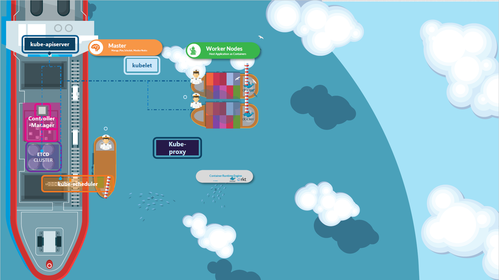
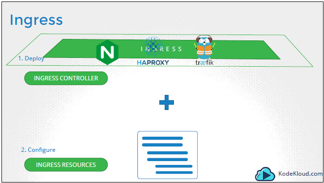
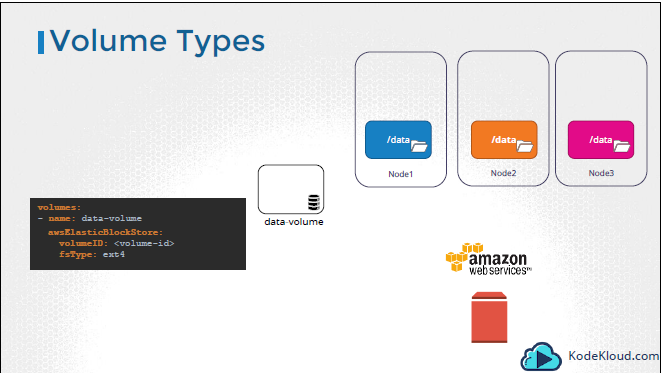

# Certified Kubernetes Application Developer (CKAD)

## Kubernetes (Container Orchestration)

Kubernetes is an open-source container orchestration platform that automates the deployment, scaling, and management of containerized applications. It was originally developed by Google, and is now maintained by the Cloud Native Computing Foundation (CNCF).

Some purpose of Kubernetes are the following:
- Automating the Deployments, Rollouts & Rollbacks 
- Making sure our services are self-healing
- Autoscaling our services

1) ``Automating the Deployments, Rollouts & Rollbacks :`` Inside microservices, we should try to automate as much as possible because inside microservices, we are going to deal hundreds of applications. We should try to automate each and every task like doing deployments, rollouts and rollbacks.
Rollout: Whenever you try to make some changes or whenever you try to build a new version of your microservices, you need to push them or deploy them into the production server. When you try to do that deployment, bigger organizations cannot afford a downtime. So, in such scenarios, they will go with an option of rollout. So, as part of this rollout, they are going to replace the containers one by one with the latest Docker image. Think like for account microservice, you have three Docker containers running inside your production. With the help of this rollout, we can first try to create a new container with the latest Docker image. Once the container is available, then only we can terminate the previous running containers. So this will avoid any downtime that organizations may face while doing the deployment.
Rollback: And in the similar lines, think like when you rollout a new feature or a new Docker image into your containers, you face some issue. There is a bug identified in the production server. In such scenarios, you should also have a flexibility of automatic rollback to the previous running  version of the Docker image.


2) ``Making sure our services are self-healing :`` How do we automatically restart containers that fail, replace containers, kill containers that do not respond to your user-defined health check, and does not advertise them to clients until they are ready to server.


3) ``Autoscaling our services :`` How do we monitor our services and scale them automatically based on metrics like CPU Utilization. For example, let's take an example of Netflix. Usually, there will be a lot of traffic to the Netflix on the Friday night, on the Saturday and Sunday. So during these days, the Netflix should automatically scale their number of microservice instances or applications so that they can stream the content to their customers without any issues.


### The story of why we choose Kubernetes

As of now, you are aware that we can build lot many microservices, and in the same journey,
first we are building spring boot applications, and we are trying to package it as a Docker image, 
and post that with the help of Docker server, we are converting these images into running containers so that 
we can access all our microservice applications. We cah have 7-8 microservices in our local development,
but in the real world, we can have more than 100 microservices. 
That means you may have more than 100 different containers running inside your production server. 
So, whenever you have such kind of larger number of containers inside your organizations, 
we need a component that is going to take care of container orchestration.

----------------------------------------------------------------------------------------

## KUBERNETES ARCHITECTURE

The purpose of Kubernetes is to host your applications in the form of containers in an automated fashion so that you can easily deploy as many instances of your application.


We have 2 kind of ships in this analogy.
- Cargo ships that does the actual work of carrying containers across the sea.
- Control ships that are responisble for monitoring and managing the cargo ships.

The Kubernetes clusters consists of a set of nodes which may be physical or virtual on premise or on cloud that host applications in the form of containers. This relate to the cargo ships in this analogy. Worker nodes in the clusters are ships that can load containers, but somebody needs to load the containers on the ships not just load, plan how to load, identify the right ships, store information about the ships, monitor and track the location of containers on the ships. This is done by control ships that host different offices and departments, monitoring equipments, communication equipments. The control ships relate to the master node in the Kubernetes cluster. The master node is responsible for managing the Kubernetes cluster, storing information regarding the different nodes, planning which containers goes where, monitoring the nodes and containers on them.


### Components of Master and Worker Node




### Master Node Components
#### 1) ETCD

Etcd is a database that stores information in a key-value format. Every information you see when you run the kubectl get command is from the etcd server. Every change you make to your cluster such as adding additional nodes, deploying pods or replica sets are updated in the etcd server.

#### 2) Controller Manager

In Kubernetes, we have controllers availabe that take care of different areas.
The Node controller takes care of nodes. They are responsible for onboarding new nodes to the cluster, handling situations where nodes become unavailable or get destroyed.
The Replication controller ensures that the desired number of containers are running at all times in a replication group.

#### 3) Scheduler

When ships arrive, you load containers on them using cranes. The cranes identify the containers that need to be placed on ships. It identify the right ship based on its size, its capacity, the number of containers already on the ship, the type of containers it is allowed to carry etc. Those are schedulers in a Kubernetes cluster. A scheduler identifies the right node to place a container on based on the containers resource requirements, the worker nodes capacity.

The scheduler is only responsible for deciding which pod goes on which node. It does not actually place the pod on the nodes. That is the job of the kubelet. The kubelet or captain on the ship is who creates the pod on the ship. The scheduler only decides which pod goes where.
#### 4) Kube-apiserver

You have seen different components like different ships, offices, the data store, the cranes. But, how do these communicate with each other?
The Kube-apiserver is the primary management component of Kubernetes. The Kube API server is responsible for orchestrating all operations within the cluster. It exposes the Kubernetes API which is used by external users to perform management operations on the cluster as well as the various controllers to monitor the state of the cluster.
We all work with containers in here, so we need Docker installed on all the nodes in the cluster.

When you run a kubectl command, the kubectl utility is in fact reaching to the kube-apiserver.

Let's look at an example of creating a pod. When you do that, the request is authenticated first, then validated. In this case, the kube-apiserver creates a pod object without assigning it to a node. Updates the information in the etcd server, updated the user that the pod has been created. The scheduler continuosly monitors the API server and realizes that there is a new pod with no node assigned. The scheduler identifies the right node to place the new pod on, and communicates that back to the kube-apiserver. The API server then updates the information in the etcd cluster. The API server then passes that information to the kubelet in the appropriate worker node. The kubelet then creates the pod on the node and instructs the container runtine engine to deploy the application image. Once done, the kubelet updates the status back to the API server, and the API server then updates the data back to the etcd cluster.

### Worker Node Components

#### 1) Kubelet

Let us now turn our focus onto the cargo ships. Now, every ship has a captain. The captain is responsible for managing all activities on the ship. The captain is responsible for liasing with the master ship, starting with letting the master ship know they are interested in joining the group, receiving information about the containers to be loaded on the ship, and loading the appropriate containers as required, sending reports back to the master node about the status of this ship, and the status of the containers on the ship etc. The captain of the ship is the kubelet in Kubernetes.
A kubelet is an agent that runs on each node in a cluster. It listens for instructions from the Kube API server, and deploys and destroys containers on the nodes as required. The Kube API server periodically fetches status reports  from the kubelet to monitor the status of nodes and containers on them.

Kubelet is the captain of the ship. They are the sole point of contact from the mastership. They load and unload containers on the ship as instructed by the scheduler on the master. They also send back reports at regular intervals on the status of the ship and containers on them.

The kubelet in the kubernetes worker node registers the node with a Kubernetes cluster. When it receives instructions to load a container or a pod on the node, it requests the container runtime engine which may be Docker to pull the required image and run an instance. The kubelet then continues to monitor the state of the pod and containers in it and reports back to the kube API server on a timely basis.

#### 2) Kube-proxy

The kubelet was more of a captain on the ship that manages containers on the ship, but the application running on the worker nodes need to be able to communicate with each other. For example, you might have a web server running in one container on one of the nodes and a database server running on another container on another node. How would the web server reach the database server on the other node? Communication between worker nodes are enabled by another component that runs on the worker node know as the Kube-proxy Service. The Kube-proxy Service ensures that the necessary rules are in place on the worker nodes to allow containers running on them to reach each other.


Within a Kubernetes cluster, every pod can reach every every other pod. This is accomplished by deploying a pod networking solution to the cluster. A POD Network is an internal virtual network that spans across all the nodes in the cluster to which all the pods connect to. Through this network, they're able to communicate with each other. There are many solutions available for deploying such a network. In this case, I have a web application deployed on the first node, and a database application deployed on the second node. The web app can reach the database simply by using the IP of the pod , but there is no guarantee that the IP of the database pod will always remain the same. If you have gone through the lecture on services, you must know that a better way for the web application to access the database is using a service, so we create a service to expose the database application across the cluster. The web application can now access the database using the same name of the service, db. The service also gets an IP address assigned to it. Whenever a pod tries to reach the service using its IP or name, it forwards the traffic to the backend pod in this case the database. But, what is this service, and how does it get an IP? Does the service join the same POD network? The service cannot join the POD network because the service is not an actual thing. It is not a container like pods, so it doesn't have any interfaces. It is a virtual component that only lives in the Kubernetes memory. But then, we also said that the service should be accessible accross the cluster from any nodes. So, how is that achieved? That's where kube-proxy comes in. Kube-proxy is a process that runs on each node in the Kubernetes cluster. Its job is to look for new services.

-------------------------------------------------------------------------------------------------

## Kubernetes Objects

Kubernetes uses YAML files as input for the creation of objects such as PODs,
Replicas, Deployments, Services etc. All of these follow similar structure.

A kubernetes definition file always contains 4 top level fields. The
apiVersion, kind, metadata and spec. These are top level or root level properties. Think of them as
siblings, children of the same parent. These are all REQUIRED fields, so you MUST
have them in your configuration file.

### 1) POD

With Kubernetes, our ultimate aim is to deploy our
application in the form of containers on a set of machines that are configured as
worker nodes in a cluster. However, kubernetes does not deploy containers directly
on the worker nodes. The containers are encapsulated into a Kubernetes object
known as PODs. A POD is a single instance of an application. A POD is the smallest
object, that you can create in kubernetes.


Here we see the simplest of simplest cases were you have a single node kubernetes
cluster with a single instance of your application running in a single docker container
encapsulated in a POD. What if the number of users accessing your application
increase and you need to scale your application? You need to add additional
instances of your web application to share the load. Now, were would you spin up
additional instances? Do we bring up a new container instance within the same
POD? No! We create a new POD altogether with a new instance of the same
application. As you can see we now have two instances of our web application
running on two separate PODs on the same kubernetes system or node.


What if the user base further increases and your current node has no sufficient
capacity? Well then you can always deploy additional PODs on a new node in the
cluster. You will have a new node added to the cluster to expand the cluster’s physical
capacity. So, what I am trying to illustrate in this picture is that, Pods usually
have a one-to-one relationship with containers running your application. To scale UP
you create new PODs and to scale down you delete pods. You do not add additional
containers to an existing pod to scale your application.


Now we just said that PODs usually have a one-to-one relationship with the
containers, but, are we restricted to having a single container in a single POD? No! A
single pod can have multiple containers, except for the fact that they are usually not
multiple containers of the same kind. As we discussed in the picture slide, if our
intention was to scale our application, then we would need to create additional
pods. But sometimes you might have a scenario were you have a helper container,
that might be doing some kind of supporting task for our web application such as
processing a user entered data, processing a file uploaded by the user etc. and you
want these helper containers to live along side your application container. In that
case, you can have both of these containers part of the same pod, so that when a
new application container is created, the helper is also created and when it dies the
helper also dies since they are part of the same pod. The two containers can also
communicate with each other directly by referring to each other as ‘localhost’ since
they share the same network namespace. Plus they can easily share the same storage
space as well.


```
  apiVersion: v1
  kind: Pod
  metadata:
    name: myapp-pod
    labels:
      app: myapp
      type: front-end
  spec:
    containers:
      - name: nginx-container
        image: nginx
```


We haven’t really talked about the concepts on how a user can
access the nginx web server. And so in the current state we haven’t made the web
server accessible to external users. You can access it internally from the Node though.
For now we will just see how to deploy a POD and in a later once we learn
about networking and services we will get to know how to make this service accessible to end users.


### 2) REPLICA SET

What is a replica, and why do we need a replication controller? Let's go back to our first scenario where we had a single pod running our application. What if for some reason, our application crashes and the pod fails? Users will no longer be able to acccess our application. To prevent users from losing access to our application, we would like to have more than one instance or pod running at the same time. That way if one fails, we still have our application running on the other one. The replication controller helps us run multiple instances of a single pod in the Kubernetes cluster, thus providing high availability. So does that mean you can't use a replication controller if you plan to have a single pod? No. Even if you have a single pod, the replication controller can help by automatically bringing up a new pod when the existing one fails. Thus, the replication controller ensures that the specified number of pods are running at all times even if it's just one or hundred.

It is important to note that there are two similar terms, replication controller and replica set. Both have the same purpose, but they're not the same. Replication controller is the older technology that is being replaced by Replica set. Replica set is the new recommended way to set up replication. However, whatever we discussed in the previous few slides remain applicable to both these technologies. There are minor differences in the way each works, and we will look at that in a bit. As such, we will try to stick to replica set in all of our demos and implementations going forward.


The selector section helps the Replica Set identify what pods fall under it. But, why would you have to specify what pods fall under it if you have provided the contents of the pod definition file itself in the template? It is because Replica Set can also manage pods that were not created as part of the Replica Set creation. Say for example, there are pods created before the creation of the Replica Set that match labels specified in the selector, the Replica Set will also take those pods into consideration when creating the replicas.

How does the Replica Set know what pods to monitor? There could be hundreds of other pods in the cluster running different applications. This is where labeling our pods during creation comes in handy. We could now provide these labels as a filter for Replica Set.


```
  apiVersion: apps/v1
  kind: ReplicaSet
  metadata:
    name: myapp-replicaset
    labels:
      app: myapp
      type: front-end
  spec:
    template:
      metadata:
        name: myapp-pod
        labels:
          app: myapp
          trype: front-end
      spec:
        containers:
          - name: nginx-container
            image: nginx
    replicas: 3
    selector:
      matchLabels:
        type: front-end


```

### 3) DEPLOYMENT

For a minute, let us forget about pods, and replica sets, and other Kubernetes concepts, and talk about
how you might want to deploy your application in a production environment.

Say for example you have a web server that needs to be deployed in a production environment. You need not one, but many such instances
of the web server running for obvious reasons. Secondly, whenever newer versions
of application builds become available on the Docker registry, you would like to upgrade your Docker instances seamlessly. However, when you upgrade your instances, you do not want to upgrade all of them
at once as we just did, this may impact users accessing our applications so you might want to upgrade them one after the other. That kind of upgrade is known as rolling updates.
Suppose one of the upgrades you performed resulted in an unexpected error and you're asked to undo the recent change, you would like to be able to roll back the changes
that were recently carried out.
Finally, say for example, you would like to make multiple changes to your environment such as upgrading the underlying web server versions
as well as scaling your environment, and also modifying the resource allocations, et cetera, you do not want to apply each change immediately after the command is run. Instead, you would like to apply a pause to your environment, make the changes, and then resume so that all the changes are rolled out together. All of these capabilities are available with the Kubernetes deployments.

So far in this course, we discussed about pods, which deploy single instances of our application such as the web application in this case.
Each container is encapsulated in pods. Multiple such pods are deployed using replication controllers or replica sets.
And then comes deployment, which is a Kubernetes object
that comes higher in the hierarchy. The deployment provides us with the capability
to upgrade the underlying instances seamlessly using rolling updates, undue changes,
and pause and resume changes as required.


``So how do we create a deployment?``

As with the previous components, we first create a deployment definition file.
The contents of the deployment definition file are exactly similar to the replica set definition file except for the kind which is now going to be deployment


### 4) NAMESPACE


### 5) CONFIGMAP

### 6) SECRET

### 7) SERVICE


 #### Service Types
  - ClusterIP
  - NodePort
  - LoadBalancer


-------------------------------------------------------------------------------------------------


## COMMANDS

### 1) PODS

- #### To create a Pod running nginx

    ```
    kubectl run nginx --image nginx
    ```
- #### To create a Pod by using a pod-definition.yml file
    ```
    - kubectl create -f pod-definition.yml
    ```
- #### To list all Pods
    ```
    - kubectl get pods
    ```
- #### To see the details of a Pod named as myapp-pod
    ```
    - kubectl describe pod myapp-pod
    ```
- #### To delete a Pod named as myapp-pod
    ```
    - kubectl delete pod myapp-pod
    ```

### 2) REPLICA SETS

- #### To create a Replica Set using a replicaset-definition.yml
    ```
    kubectl create -f replicaset-definition.yml
    ```
- #### To list all Replica Sets
    ```
    kubectl get replicaset
    ```
- #### To delete a Replica Set named as myapp-replicaset
    ```
    kubectl delete replicaset myapp-replicaset
    ```
- ####  To update/replace the existing Replica Set
    ```
    kubectl replace -f replicaset-definition.yml
    ```
- #### To scale replicas in the .yml file ( Note: This will not edit the .yml file )
    ```
    kubectl scale --replicas=6 -f replicaset-definition.yml
    ```
- #### To edit a Replica Set named as new-replica-set (This will open the .yml file)
    ```
    kubectl edit replicaset new-replica-set
    ```
### 3) DEPLOYMENTS

- #### To create a Deployment using a deployment-definition.yml
    ```
    kubectl create -f deployment-definition.yml
    ```
- #### To list all deployments
    ```
    kubectl get deployments
    ```
- #### To see all the created objects at once
    ```
    kubectl get all
    ```
- #### To create a new deployment with these values (name: httpd-frontend, replicas: 3, image: httpd:2.4-alpine)
    ```
    kubectl create deployment httpd-frontend --image=httpd:2.4-alpine --replicas=3
    ```

### 4) NAMESPACES

- #### To see all namespaces
    ```
    kubectl get namespaces
    ```
- #### To see the pods in kube-system namespace
    ```
    kubectl get pods --namespace=kube-system
    ```
- #### To create a namespace using namespace-definition.yml
    ```
    kubectl create -f namespace-definition.yml
    ```
- #### Another way to create a namespace with a name dev
    ```
    kubectl create namespace dev
    ```
- #### To view pods in all namespaces
    ```
    kubectl get pods --all-namespaces
    ```
- #### To create a pod (with .yml file) inside a specific namespace named as team1
    ```
    kubectl create -f pod-definition.yml --namespace=team1
    ```
- #### To create a pod (with name and image name as redis) inside a specific namespace named as team1
    ```
    kubectl run redis --image=redis --namespace=team1
    ```
- #### To switch to the dev namespace permanently;
    ```
    kubectl config set-context $(kubectl config current-context) --namespace=dev
    ```


#### Notes (Imperative Commands):

- --dry-run: By default, as soon as the command is run, the resource will be created. If you simply want to test your command, use the --dry-run=client option. This will not create the resource. Instead, tell you whether the resource can be created and if your command is right.

- -o yaml: This will output the resource definition in YAML format on the screen.

      Syntax:

      ```
      kubectl run nginx --image=nginx --dry-run=client -o yaml > nginx-pod.yaml
      ```

      ```
      kubectl create deployment nginx --image=nginx--dry-run=client -o yaml > nginx-deployment.yaml
      ```

#### Notes (Editing Pods and Deployments):

- Syntax:

  ```
  kubectl edit pod <pod name>
  ```

- Syntax: 

  ```
  kubectl edit deployment my-deployment
  ```

### 5) CONFIGMAP

- #### To create a configmap imperatively
    ```
    kubectl create configmap <config-name> --from-literal=<key>=<value>
    ```
    ```
    kubectl create configmap <config-name> --from-file=<path-to-file>
    ```
  
- #### To create a configmap declarative
    ```
    kubectl create –f config-map.yaml
    ```
  
- #### To view all configmaps
    ```
    kubectl get configmaps
    ```
  
- #### To see data under configmaps
    ```
    kubectl describe configmaps
    ```

### 6) SECRETS

- #### To create a secret imperatively
    ```
    kubectl create secret generic <secret-name> --from-literal=<key>=<value>
    ```
    ```
    kubectl create secret generic <secret-name> --from-file=<path-to-file>
    ```

- #### To create a secret declarative
    ```
    kubectl create –f secret-data.yaml
    ```
  
- #### To view all secret
    ```
    kubectl get secrets
    ```

- #### To see attributes under secret (This shows the attributes in secret, but not the values)
    ```
    kubectl describe secrets
    ```
  
- #### To view values as well under secret named as app-secret
    ```
    kubectl get secret app-secret -o yaml
    ```

  #### Note on Secrets;
  - Secrets are not Encrypted. Only encoded.
  - Secrets are not encrypted in etcd.
    Enable encryption at rest (means normally etcd does not store secrets in an encrypted format, it stores them as plain text, and anyone who can connect to etcd with etcd client can see the credential data, so we need to encrypt them at rest).
  - Anyone able to create pods/deployments in the same namespace can access the secrets.
    Configure least-privilege access to Secrets RBAC.
  - Consider third-party secrets store providers like AWS Provider, Azure Provider, GCP Provider, Vault Provider.


### 7) SERVICE ACCOUNT

- #### To create a ServiceAccount with a name dashboard-sa
    ```
    kubectl create serviceaccount dashboard-sa
    ```

- #### To view all ServiceAccount
    ```
    kubectl get serviceaccount
    ```

- #### To see details of a ServiceAccount named as dashboard-sa
    ```
    kubectl describe serviceaccount dashboard-sa
    ```

- #### To create a Token for this ServiceAccount named as dashboard-sa
    ```
    kubectl create token dashboard-sa
    ```
  
- #### To see the ServiceAccount credentials (token) available within the pod named as my-kubernetes-dashboard
    ```
    kubectl exec -it my-kubernetes-dashboard cat /var/run/secrets/kubernetes.io/serviceaccount/token
    ```
### 8) ROLLING UPDATES & ROLLBACK

- #### To create a deployment with a deployment-definition.yaml file
    ```
    kubectl create -f deployment-definition.yaml
    ```
- #### To get all deployments
    ```
    kubectl get deployments
    ```
- #### To update a with deployment-definition.yaml file
    ```
    kubectl apply -f deployment-definition.yaml
    ```
- #### To update a deployment's image without changing manifest file
    ```
    kubectl set image deployment/myapp-deployment nginx=nginx:1.9.1
    ```
- #### To see the status of current deployment
    ```
    kubectl rollout status deployment/myapp-deployment
    ```  
- #### To see the history of the deployment named as deployment/myapp-deployment
    ```
    kubectl rollout history deployment/myapp-deployment
    ```  
- #### To rollback the deployment
    ```
    kubectl rollback undo deployment/myapp-deployment
    ```  


------------------------------------------------------------------------------------------------


## OBSERVABILITY

### 1) READINESS PROBE


The POD status tells us were the POD is in its lifecycle. When a POD is first created, it
is in a Pending state. This is when the Scheduler tries to figure out were to place the
POD. If the scheduler cannot find a node to place the POD, it remains in a Pending
state. To find out why it’s stuck in a pending state, run the kubectl describe pod
command, and it will tell you exactly why.

Once the POD is scheduled, it goes into a ContainerCreating status, were the images
required for the application are pulled and the container starts. Once all the
containers in a POD starts, it goes into a running state, were it continues to be until
the program completes successfully or is terminated.

You can see the pod status in the output of the kubectl get pods command. So
remember, at any point in time the POD status can only be one of these values and
only gives us a high level summary of a POD. However, at times you may want
additional information.

Conditions compliment POD status. It is an array of true or false values that tell us the
state of a POD. When a POD is scheduled on a Node, the PodScheduled condition is
set to True. When the POD is initialized, it’s value is set to True. We know that a POD
has multiple containers. When all the containers in the POD are ready, the Containers
Ready condition is set to True and finally the POD itself is considered to be Ready.

To see the state of POD conditions run the kubectl describe POD command and look
for the conditions section.

You can also see the Ready state of the POD, in the output of the kubectl get pods
command, and that is the condition we are interested in


The ready conditions indicate that the application inside the POD is running and is
ready to accept user traffic. What does that really mean? The containers could be
running different kinds of applications in them. It could be a simple script that
performs a job. It could be a database service. Or a large web server, serving front
end users. The script may take a few milliseconds to get ready. The database service
may take a few seconds to power up. Some web servers could take several minutes to
warm up. If you try to run an instance of a Jenkins server, you will notice that it takes
about 10 15 seconds for the server to initialize before a user can access the web UI.
Even after the Web UI is initialized, it takes a few seconds for the server to warm up
and be ready to serve users. During this wait period if you look at the state of the
POD, it continues to indicate that the POD is ready, which is not very true.

So why is that happening and how does kubernetes know weather that the
application inside the container is actually running or not? But before we get into


So how do you configure that test? In the pod definition file, add a new field called
readinessProbe and use the httpGet option. Specify the port and the ready api. Now
when the container is created, kubernetes does not immediately set the ready
condition on the container to true, instead, it performs a test to see if the api
responds positively. Until then the service does not forward any traffic to the pod, as
it sees that the POD is not ready.

There are some additional options as well. If you know that your
application will always take a minimum of, say, 10 seconds to warm up, you can add
an initial delay to the probe. If you’d like to specify how often to probe, you can do
that using the periodSeconds option. By default, if the application is not ready after 3
attempts, the probe will stop. If you’d like to make more attempts, use the
failureThreshold option.

### 2) LIVENESS PROBE


Let’s start from the basics. You run an image of NGINX using docker and it starts to
serve users. For some reason the web server crashes and the nginx process exits. The
container exits as well. And you can see the status of the container when you run the
docker ps command. Since docker is not an orchestration engine, the container
continues to stay dead and deny services to users, until you manually create a new
container.

Enter Kubernetes Orchestration. You run the same web application with kubernetes.
Every time the application crashes, kubernetes makes an attempt to restart the
container to restore service to users. You can see the count of restarts increase in the
output of kubectl get pods command. Now this works just fine.


However, what if the application is not really working but the container continues to
stay alive? Say for example, due to a bug in the code, the application is stuck in an
infinite loop. As far as kubernetes is concerned, the container is up, so the application
is assumed to be up. But the users hitting the container are not served. In that case,
the container needs to be restarted, or destroyed and a new container is to be
brought up. That is where the liveness probe can help us. A liveness probe can be
configured on the container to periodically test whether the application within the
container is actually healthy. If the test fails, the container is considered unhealthy
and is destroyed and recreated.


However, what if the application is not really working but the container continues to
stay alive? Say for example, due to a bug in the code, the application is stuck in an
infinite loop. As far as kubernetes is concerned, the container is up, so the application
is assumed to be up. But the users hitting the container are not served. In that case,
the container needs to be restarted, or destroyed and a new container is to be
brought up. That is where the liveness probe can help us. A liveness probe can be
configured on the container to periodically test whether the application within the
container is actually healthy. If the test fails, the container is considered unhealthy
and is destroyed and recreated.


The liveness probe is configured in the pod definition file as you did with the
readinessProbe . Except here you use liveness instead of readiness.

As well as additional options like initialDelay before the test is
run, periodSeconds to define the frequency and success and failure thresholds.


### 3) CONTAINER LOGGING

Once it’s the pod is running, we can view the logs using the kubectl
logs command with the pod name. Use the –f option to stream the logs live.

```
kubectl logs -f <pod-name>
```
Use the –f option to stream the logs live.


Now, these logs are specific to the container running inside the POD. As we learned
before, Kubernetes PODs can have multiple docker containers in them. In this case I
modify my pod definition file to include an additional container called imageprocessor.
If you ran the kubectl logs command now with the pod name, which
container’s log would it show? If there are multiple containers within a pod, you must
specify the name of the container explicitly in the command, otherwise it would fail
asking you to specify a name. In this case I will specify the name of the first
container event-simulator and that prints the relevant log messages.

## POD DESIGN

### 1) Labels and Selectors

``Labels`` are properties attached to each item. So you add properties to each item for  their class, kind and color.


``Selectors`` help you filter these items. For example, when you say class equals mammal, we get a list of mammals. And when you say color equals green, we get the  green mammals.


So how are labels and selectors used in Kubernetes? We have created a lot of
different types of Objects in Kuberentes . Pods, Services, ReplicaSets and
Deployments. For Kubernetes, all of these are different objects. Over time you may
end up having 100s and 1000s of these objects in your cluster. Then you will need a
way to filter and view different objects by different categories. Like

Once the pod is created, to select the pod with the labels use the kubectl get pods
command along with the selector option, and specify the condition like app=App1.

```
kubectl get pods --selector app=App1
```


Kubernetes objects use labels and selectors internally to connect different objects together. For example to create a
replicaset consisting of 3 different pods, we first label the pod definition and use
selector in a replicaset to group the pods . In the replica set definition file, you will
see labels defined in two places. Note that this is an area where beginners tend to
make a mistake. The labels defined under the template section are the labels
configured on the pods. The labels you see at the top are the labels of the replica set.
We are not really concerned about that for now, because we are trying to get the
replicaset to discover the pods. The labels on the replicaset will be used if you were
configuring some other object to discover the replicaset . In order to connect the
replica set to the pods, we configure the selector field under the replicaset
specification to match the labels defined on the pod. A single label will do if it
matches correctly. However if you feel there could be other pods with that same label

On creation, if the labels match, the
replicaset is created successfully.

It works the same for other objects like a service. When a service is created, it uses
the selector defined in the service definition file to match the labels set on the pods
in the replicaset definition file.

### 2) Rolling Updates & Rollbacks in Deployments


Before we look at how we upgrade our application, let’s try to understand Rollouts
and Versioning in a deployment. Whenever you create a new deployment or upgrade
the images in an existing deployment it triggers a Rollout. A rollout is the process of
gradually deploying or upgrading your application containers. When you first create a
deployment, it triggers a rollout. A new rollout creates a new Deployment revision.
Let’s call it Revision 1. In the future when the application is upgraded – meaning
when the container version is updated to a new one – a new rollout is triggered and a
new deployment revision is created named Revision 2. This helps us keep track of the
changes made to our deployment and enables us to rollback to a previous version of
deployment if necessary.


There are two types of deployment strategies :
- Say for example you have 5 replicas of
your web application instance deployed. One way to upgrade these to a newer
version is to destroy all of these and then create newer versions of application
instances. Meaning first, destroy the 5 running instances and then deploy 5 new
instances of the new application version. The problem with this as you can imagine,
is that during the period after the older versions are down and before any newer
version is up, the application is down and inaccessible to users. This strategy is
known as the Recreate strategy, and thankfully this is NOT the default deployment
strategy.


- The second strategy is were we do not destroy all of them at once. Instead we take
down the older version and bring up a newer version one by one. This way the
application never goes down and the upgrade is seamless.
Remember, if you do not specify a strategy while creating the deployment, it will
assume it to be Rolling Update. In other words, RollingUpdate is the default Deployment Strategy.

  


So we talked about upgrades. How exactly DO you update your deployment? When I
say update it could be different things such as updating your application version by
updating the version of docker containers used, updating their labels or updating the
number of replicas etc. Since we already have a deployment definition file it is easy
for us to modify this file. Once we make the necessary changes, we run the kubectl
apply command to apply the changes. A new rollout is triggered and a new revision of
the deployment is created.
But there is ANOTHER way to do the same thing. You could use the
kubectl set image
command to update the image of your application. But remember, doing it this way
will result in the deployment definition file having a different configuration. So you
must be careful when using the same definition file to make changes in the future.


#### To summarize commands related to rollout & rollback deployments :


## SERVICES & NETWORKING

Kubernetes services enable communication between various components within and outside of the application. Kubernetes services helps us connect applications together with other applications or users. For example, our application has groups of pod running various sections such as a group for serving a frontend load to users, another group for running backend-processes, and third group connecting to an external data source. It is services that enable connectivity between these groups of pods. Services enable the frontend application to be made available to end users. It helps communication between backend and frontend pod, and helps in establishing connectivity to an external data source. Those services enable loose coupling between microservices in our application.

### Kubernetes Service Types

#### 1) NodePort

Let's start with external communication.


So we deployed our pod having a web application running on it. How do we as an external user access the webpage? First of all, let's look at the existing setup. The Kubernetes node has an IP address
and that is 192.168.1.2. My laptop is on the same network as well
so it has an IP address, 192.168.1.10.
The internal pod network is in the range 10.244.0.0 and the pod has an IP 10.2.44.0.2. Clearly, I cannot ping or access the pod at address
10.244.0.2 as it's in a separate network. So what are the options to see the webpage?

First, if we were to SSH into the Kubernetes node at 192.168.1.2 from the node we would be able
to access the pod's webpage by doing a curl. Or if the node has a GUI, we would fire up a browser
and see the webpage in a browser following the address http://10.244.0.2. But this is from inside the Kubernetes node
and that's not what I really want.

I want to be able to access the web server from my own laptop without having to SSH into the node and simply by accessing the IP of the Kubernetes node. So we need something in the middle to help us map request to the node from our laptop through the node to the pod running the web container. This is where the Kubernetes service comes into play. The Kubernetes service is an object just like pods, ReplicaSet, or deployments that we worked with before. One of its use case is to listen to a port on the node and forward request on that port to a port on the pod running the web application.

This type of service is known as a NodePort service because the service listens to a port on the node and forward request to the pods. 

### ``NodePort is a service which makes an internal pod accessible on a port on the node.``


Let's take a closer look at the service.


If you look at it, there are three ports involved. The port on the pod where the actual web server is running is 80 and it is referred to as the target port because that is where the service forwards the request to. The second port is the port on the service itself, it is simply referred to as the port.
Remember, these terms are from the viewpoint of the service. The service is in fact like a virtual server inside the node. Inside the cluster, it has its own IP address,
and that IP address is called the cluster IP of the service. And finally, we have the port on the node itself which we use to access the web server externally and that is known as the node port. As you can see, it is set to 30,008. That is because node ports can only be in a valid range which by default is from 30,000 to 32,767.


Let's now look at how to create the service.


Just like how we created a deployment ReplicaSet or pod in the past we will use a definition file to create a service. The high level structure of the file remains the same as before. We have the API version, kind, metadata, and spec sections. The API version is going to be v1. The kind is, of course, service. The metadata will have a name and that will be the name of the service. It can have labels, but we don't need that for now. Next, we have spec, and as always this is the most crucial part of the file as this is where we will be defining the actual services. And this is the part
of a definition file that differs between different objects. In the spec section of a service, we have type and ports. The type refers to the type of service we are creating. As discussed before it could be ClusterIP, NodePort, or LoadBalancer.
In this case, since we are creating a NodePort we will set it as NodePort. The next part of a spec is ports. This is where we input information regarding what we discussed on the left side of the screen. The first type of port is the target port
which we will set to 80. The next one is simply port, which is a port on the service object, and we will set that to 80 as well.
The third is node port, which we will set to 30,008 or any number in the valid range.

Remember that out of these,
the only mandatory field is port.
If you don't provide a target port
it is assumed to be the same as port. And if you don't provide a node port a free port in the valid range between 30,000 and 32,767
is automatically allocated.


#### 2) ClusterIP

This is the default service that uses an internal Cluster IP to expose Pods. In ClusterIP, the services
are not available for external access of the cluster and used for internal communication between different pods
or microservices in the cluster.


A full stack web application typically has different kinds of pods hosting different parts of an application. You may have a number of pods running a front end web server, another set of pods running a backend server,
a set of pods running a key value store like Redis, and another set of pods may be running a persistent database like MySQL. The web front end server needs to communicate to the backend servers, and the backend servers need to communicate to the database as well as the Redis services, et cetera. So what is the right way to establish connectivity between these services or tiers of my application?

The pods all have an IP address assigned to them as we can see on the screen. But these IPs, as we know, are not static. These pods can go down any time and new pods are created all the time, and so you cannot rely on these IP addresses for internal communication between the application. Also, what if the first front end pod at 10.244.0.3 need to connect to a backend service? Which of the three would it go to, and who makes that decision? A Kubernetes service can help us group the pods together and provide a single interface to access the pods in a group. For example, a service created for the backend pods will help group all the backend pods together and provide a single interface for other pods to access this service. The requests are forwarded to one of the pods under the service randomly. Similarly, create additional services for Redis and allow the backend parts to access the Redis systems through the service. This enables us to easily and effectively deploy a microservices based application on Kubernetes cluster. Each layer can now scale or move as required without impacting communication between the various services. Each service gets an IP, a name, assigned to it inside the cluster, and that is the name that should be used by other pods to access the service. This type of service is known as ClusterIP.


To create such a service, as always use a definition file in the service definition file.


First, use the default template which has API version, kind, metadata, and spec. The API version is V1, kind is service. And we will give a name to our service. We will call it backend.
Under specification, we have type and ports. The type is ClusterIP. In fact, ClusterIP is the default type, so even if you didn't specify it, it will automatically assume the type to be ClusterIP. Under ports, we have a target port and port. The target port is the port where the backend is exposed, which in this case is 80, and the port is where the service is exposed, which is 80 as well. To link the service to a set of pods, we use selector. we will refer to the pod definition file, and copy the labels from it and the move it under selector, and that should be it.


#### 3) LoadBalancer

This service is exposed like in NodePort but creates a load balancer in the cloud where K8s is running
that receives external requests to the service. It then distributes them among the cluster nodes using NodePort.


This is very similar to NodePort, but on top of NodePorts that we have exposed, the Kubernetes is going to provide you a load balancer, and this load balancer will have a public IP address, which is never going to change until unless a Kubernetes admin is going to change. So, the same public IP address can be mapped to a DNS name or to your domain name, and the client application can send the traffic to this domain name.

LoadBalancer service has an advantage, which is it is going to provide a Load Balancer, which is always going to have a public IP address which you can map to your domain name. Regardless of how many worker nodes you are trying to create inside your Kubernetes cluster or how many worker nodes you are trying to delete them, it is not going to impact your client application.


## INGRESS

Ingress helps your users access your application using a single Externally accessible URL, 
that you can configure to route to different services within your cluster based on the URL path, 
at the same time terminate TLS.

Ingress exposes HTTP and HTTPS routes from outside the cluster to services within the cluster.
Traffic routing is controlled by rules defined on the Ingress resource. An ingress may be configured
to give Services externally-reachable URLs, load balance traffic, terminate SSL / TLS, and offer name-based
virtual hosting.


#### Why to use Ingress?
- Single Entry Point
- TLS/SSL Termination
- Path-Based Routing
- Host-Based Routing
- Load Balancing


Simply put, think of ingress as a layer 7 load balancer built-in to the kubernetes
cluster that can be configured using native kubernetes primitives just like any other
object in kubernetes.

Now remember, even with Ingress you still need to expose it to make it accessible
outside the cluster. So you still have to either publish it as a NodePort or with a Cloud
Native LoadBalancer. But that is just a one time thing.




So how does it work? What is it? Where is it? How can you see it? How can you
configure it?
So how does it load balance? How does it implement SSL?

Without ingress, how would YOU do all of these? I would use a reverse
proxy or a
load balancing solution like NGINX or HAProxy or Traefik . I would deploy them on my
kubernetes cluster and configure them to route traffic to other services. The
configuration involves defining URL Routes, SSL certificates etc.

Ingress is implemented by Kubernetes in the same way. You first deploy a supported
solution, which happens to be any of these listed here, and then specify a set of rules
to configure Ingress. The solution you deploy is called as an Ingress Controller. And
the set of rules you configure is called as Ingress Resources. Ingress resources are
created using definition files like the ones we used to create PODs, Deployments and
services earlier in this course.
Now remember a kubernetes cluster does NOT come with an Ingress Controller by
default. If you setup a cluster following the demos in this course, you won’t have an
ingress controller. So if you simply create ingress resources and expect them to work,
they wont.


### Ingress Controller


We will use NGINX as an example. An NGINX Controller is deployed
as just another deployment in Kubernetes. So we start with a deployment file
definition, named nginx-ingress-controller. With 1 replica and a simple pod definition
template. We will label it nginx-ingress and the image used is nginx-ingress-controller
with the right version. This is a special build of NGINX built specifically to be used as
an ingress controller in kubernetes. So it has its own requirements. Within the image
the nginx program is stored at location /nginx-ingress-controller. So you must pass
that as the command to start the nginx-service. If you have worked with NGINX
before, you know that it has a set of configuration options such as the path to store
the logs, keep-alive threshold, ssl settings, session timeout etc. In order to decouple
these configuration data from the nginx-controller image, you must create a
ConfigMap object and pass that in. Now remember the ConfigMap object need not
have any entries at this point. A blank object will do. But creating one makes it easy
for you to modify a configuration setting in the future. You will just have to add it in to
this ConfigMap.

You must also pass in two environment variables that carry the POD’s name and
namespace it is deployed to. The nginx service requires these to read the
configuration data from within the POD.


And finally specify the ports used by the ingress controller.


We then need a service to expose the ingress controller to the external world. So we
create a service of type NodePort with the nginx-ingress label selector to link the
service to the deployment.

### Ingress Resource


Now on to the next part, of creating Ingress Resources. An Ingress Resource is a set of
rules and configurations applied on the ingress controller. You can configure rules to
say, simply forward all incoming traffic to a single application, or route traffic to
different applications based on the URL. So if user goes to my online store.com/wear,
then route to one app, or if the user visits the /watch URL then route to the video
app. Or you could route user based on the domain name itself.


As you might have guessed already, traffic is routed to the application services and
not PODs directly. The Backend section defines where the traffic will be routed to. So
if it’s a single backend, then you don’t really have any rules. You can simply specify
the service name and port of the backend wear service. Create the ingress resource
by running the kubectl create command. View the created ingress by running the
kubectl get ingress command. The new ingress is now created and routes all
incoming traffic directly to the wear-service.


## Network Policies

All pods are on a virtual private network that
spans across the nodes in the kubernetes cluster. And they can all by default reach
each other using the IPs or pod names or services configured for that purpose.
Kubernetes is configured by default with an “All Allow” rule that allows traffic from
any pod to any other pod or services.

What if we do not want the front-end web server to be able to communicate with the
database server directly? Say for example, the security teams and audits require you
to prevent that from happening? That is where you would implement a Network
Policy to allow traffic to the db server only from the api server. Let’s see how we do
that.

A Network policy is another object in the kubernetes namespace. Just like PODs,
ReplicaSets or Services. You apply a network policy on selected pods.
or Services. You link a network policy to one or more pods. You can
define rules within the network policy. In this case I would say, only allow Ingress
Traffic from the API Pod on Port 3306. Once this policy is created, it blocks all other
traffic to the Pod and only allows traffic that matches the specified rule. Again, this is
only applicable to the Pod on which the network policy is applied.


This is the example of accepting ingress traffic from API Pod, and also
accepting the engress traffic to an application out of our Kubernetes cluster.


## STATE PERSISTENCE

Just as in Docker, the PODs created
in Kubernetes are transient in nature. When a POD is created to process data and
then deleted, the data processed by it gets deleted as well. For this we attach a
volume to the POD. The data generated by the POD is now stored in the volume, and
even after the POD is delete, the data remains.


Let’s look at a simple implementation of volumes.


We have a single node kubernetes
cluster. We create a simple POD that generates a random between 1 and 100 and
writes that to a file at /data/number.out and then gets deleted along with the
random number. To retain the number generated by the pod, we create a volume.
And a Volume needs a storage. When you create a volume you can chose to configure
it’s storage in different ways. We will look at the various options in a bit, but for now
we will simply configure it to use a directory on the host. In this case I specify a path
/data on the host. This way any files created in the volume would be stored in the
directory data on my node.

Once the volume is created, to access it from a container we mount the volume to a
directory inside the container. We use the volumeMounts field in each container to
mount the data-volume to the directory /opt within the container. The random
number will now be written to /opt mount inside the container, which happens to be
on the data-volume which is in fact /data directory on the host. When the pod gets
deleted, the file with the random number still lives on the host.

Let’s take a step back and look at the Volume Storage option. We just used the
hostPath option to configure a directory on the host as storage space for the volume.
Now that works on a single node.

However it is not recommended for use in a multi-node cluster. This is because the
PODs would use the /data directory on all the nodes, and expect all of them to be the
same and have the same data. Since they are on different servers, they are in fact not
the same, unless you configure some kind of external replicated clustered storage
solution.

Kubernetes supports several types of standard storage solutions such as NFS,
glusterFS, Flocker, FibreChannel, CephFS, ScaleIO or public cloud solutions like AWS
EBS, Azure Disk or File or Google’s Persistent Disk.



For example, to configure an AWS Elastic Block Store volume as the storage or the
volume, we replace hostPath field of the volume with awsElasticBlockStore field
along with the volumeID and filesystem type. The Volume storage will now be on
AWS EBS.

### Persistence Volumes

When we created volumes in the previous section we configured volumes within the
POD definition file. So every configuration information required to configure storage
for the volume goes within the pod definition file.

Now, when you have a large environment with a lot of users deploying a lot of PODs,
the users would have to configure storage every time for each POD. Whatever storage
solution is used, the user who deploys the PODs would have to configure that on all
POD definition files in his environment. Every time a change is to be made, the user
would have to make them on all of his PODs.

Instead, you would like to manage storage more centrally.


You would like it to be configured in a way that an administrator can create a large
pool of storage, and then have users carve out pieces from it as required. That is
where Persistent Volumes can help us. A Persistent Volume is a Cluster wide pool of
storage volumes configured by an Administrator, to be used by users deploying
applications on the cluster. The users can now select storage from this pool using
Persistent Volume Claims.

Let us now create a Persistent Volume:


### Persistence Volume Claim

We have already created a Persistent Volume. Now we will create a
Persistent Volume Claim to make the storage available to a node.
Persistent Volumes and Persistent Volume Claims are two separate objects in the
Kubernetes namespace.`` An Administrator creates a set of Persistent Volumes`` and ``a
user creates Persistent Volume Claims to use the storage``. Once the Persistent Volume
Claims are created, Kubernetes binds the Persistent Volumes to Claims based on the
request and properties set on the volume.

Let us now create a Persistent Volume Claim:


When the claim is created, kubernetes looks at the volume created previously. The
access Modes match. The capacity requested is 500 Megabytes but the volume is
configured with 1 GB of storage. Since there are no other volumes available, the PVC
is bound to the PV.


