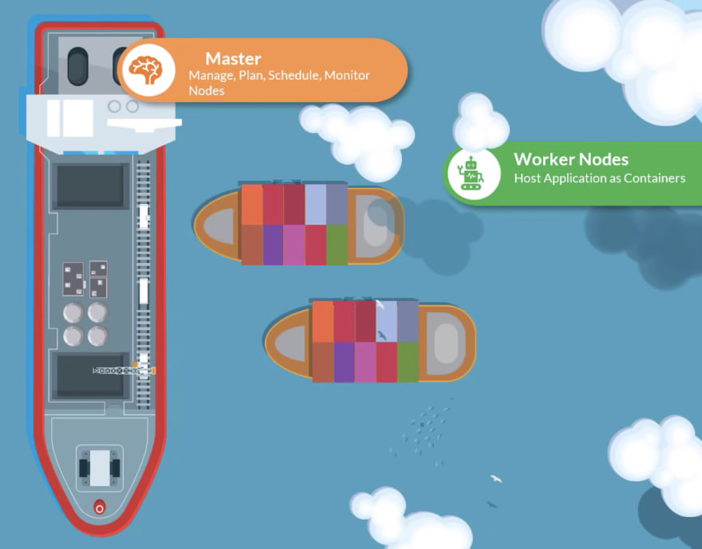

# Certified Kubernetes Application Developer (CKAD)

## Kubernetes (Container Orchestration)

Kubernetes is an open-source container orchestration platform that automates the deployment, scaling, and management of containerized applications. It was originally developed by Google, and is now maintained by the Cloud Native Computing Foundation (CNCF).

Some purpose of Kubernetes are the following:
- Automating the Deployments, Rollouts & Rollbacks 
- Making sure our services are self-healing
- Autoscaling our services

1) ``Automating the Deployments, Rollouts & Rollbacks :`` Inside microservices, we should try to automate as much as possible because inside microservices, we are going to deal hundreds of applications. We should try to automate each and every task like doing deployments, rollouts and rollbacks.
Rollout: Whenever you try to make some changes or whenever you try to build a new version of your microservices, you need to push them or deploy them into the production server. When you try to do that deployment, bigger organizations cannot afford a downtime. So, in such scenarios, they will go with an option of rollout. So, as part of this rollout, they are going to replace the containers one by one with the latest Docker image. Think like for account microservice, you have three Docker containers running inside your production. With the help of this rollout, we can first try to create a new container with the latest Docker image. Once the container is available, then only we can terminate the previous running containers. So this will avoid any downtime that organizations may face while doing the deployment.
Rollback: And in the similar lines, think like when you rollout a new feature or a new Docker image into your containers, you face some issue. There is a bug identified in the production server. In such scenarios, you should also have a flexibility of automatic rollback to the previous running  version of the Docker image.


2) ``Making sure our services are self-healing :`` How do we automatically restart containers that fail, replace containers, kill containers that do not respond to your user-defined health check, and does not advertise them to clients until they are ready to server.


3) ``Autoscaling our services :`` How do we monitor our services and scale them automatically based on metrics like CPU Utilization. For example, let's take an example of Netflix. Usually, there will be a lot of traffic to the Netflix on the Friday night, on the Saturday and Sunday. So during these days, the Netflix should automatically scale their number of microservice instances or applications so that they can stream the content to their customers without any issues.


### The story of why we choose Kubernetes

As of now, you are aware that we can build lot many microservices, and in the same journey,
first we are building spring boot applications, and we are trying to package it as a Docker image, 
and post that with the help of Docker server, we are converting these images into running containers so that 
we can access all our microservice applications. We cah have 7-8 microservices in our local development,
but in the real world, we can have more than 100 microservices. 
That means you may have more than 100 different containers running inside your production server. 
So, whenever you have such kind of larger number of containers inside your organizations, 
we need a component that is going to take care of container orchestration.

----------------------------------------------------------------------------------------

## KUBERNETES ARCHITECTURE

The purpose of Kubernetes is to host your applications in the form of containers in an automated fashion so that you can easily deploy as many instances of your application.



We have 2 kind of ships in this analogy.
- Cargo ships that does the actual work of carrying containers across the sea.
- Control ships that are responisble for monitoring and managing the cargo ships.

The Kubernetes clusters consists of a set of nodes which may be physical or virtual on premise or on cloud that host applications in the form of containers. This relate to the cargo ships in this analogy. Worker nodes in the clusters are ships that can load containers, but somebody needs to load the containers on the ships not just load, plan how to load, identify the right ships, store information about the ships, monitor and track the location of containers on the ships. This is done by control ships that host different offices and departments, monitoring equipments, communication equipments. The control ships relate to the master node in the Kubernetes cluster. The master node is responsible for managing the Kubernetes cluster, storing information regarding the different nodes, planning which containers goes where, monitoring the nodes and containers on them.


### Components of Master and Worker Node


### Master Node Components
#### 1) ETCD

Etcd is a database that stores information in a key-value format. Every information you see when you run the kubectl get command is from the etcd server. Every change you make to your cluster such as adding additional nodes, deploying pods or replica sets are updated in the etcd server.

#### 2) Controller Manager

In Kubernetes, we have controllers availabe that take care of different areas.
The Node controller takes care of nodes. They are responsible for onboarding new nodes to the cluster, handling situations where nodes become unavailable or get destroyed.
The Replication controller ensures that the desired number of containers are running at all times in a replication group.

#### 3) Scheduler

When ships arrive, you load containers on them using cranes. The cranes identify the containers that need to be placed on ships. It identify the right ship based on its size, its capacity, the number of containers already on the ship, the type of containers it is allowed to carry etc. Those are schedulers in a Kubernetes cluster. A scheduler identifies the right node to place a container on based on the containers resource requirements, the worker nodes capacity.

The scheduler is only responsible for deciding which pod goes on which node. It does not actually place the pod on the nodes. That is the job of the kubelet. The kubelet or captain on the ship is who creates the pod on the ship. The scheduler only decides which pod goes where.
#### 4) Kube-apiserver

You have seen different components like different ships, offices, the data store, the cranes. But, how do these communicate with each other?
The Kube-apiserver is the primary management component of Kubernetes. The Kube API server is responsible for orchestrating all operations within the cluster. It exposes the Kubernetes API which is used by external users to perform management operations on the cluster as well as the various controllers to monitor the state of the cluster.
We all work with containers in here, so we need Docker installed on all the nodes in the cluster.

When you run a kubectl command, the kubectl utility is in fact reaching to the kube-apiserver.

Let's look at an example of creating a pod. When you do that, the request is authenticated first, then validated. In this case, the kube-apiserver creates a pod object without assigning it to a node. Updates the information in the etcd server, updated the user that the pod has been created. The scheduler continuosly monitors the API server and realizes that there is a new pod with no node assigned. The scheduler identifies the right node to place the new pod on, and communicates that back to the kube-apiserver. The API server then updates the information in the etcd cluster. The API server then passes that information to the kubelet in the appropriate worker node. The kubelet then creates the pod on the node and instructs the container runtine engine to deploy the application image. Once done, the kubelet updates the status back to the API server, and the API server then updates the data back to the etcd cluster.

### Worker Node Components

#### 1) Kubelet

Let us now turn our focus onto the cargo ships. Now, every ship has a captain. The captain is responsible for managing all activities on the ship. The captain is responsible for liasing with the master ship, starting with letting the master ship know they are interested in joining the group, receiving information about the containers to be loaded on the ship, and loading the appropriate containers as required, sending reports back to the master node about the status of this ship, and the status of the containers on the ship etc. The captain of the ship is the kubelet in Kubernetes.
A kubelet is an agent that runs on each node in a cluster. It listens for instructions from the Kube API server, and deploys and destroys containers on the nodes as required. The Kube API server periodically fetches status reports  from the kubelet to monitor the status of nodes and containers on them.

Kubelet is the captain of the ship. They are the sole point of contact from the mastership. They load and unload containers on the ship as instructed by the scheduler on the master. They also send back reports at regular intervals on the status of the ship and containers on them.

The kubelet in the kubernetes worker node registers the node with a Kubernetes cluster. When it receives instructions to load a container or a pod on the node, it requests the container runtime engine which may be Docker to pull the required image and run an instance. The kubelet then continues to monitor the state of the pod and containers in it and reports back to the kube API server on a timely basis.

#### 2) Kube-proxy

The kubelet was more of a captain on the ship that manages containers on the ship, but the application running on the worker nodes need to be able to communicate with each other. For example, you might have a web server running in one container on one of the nodes and a database server running on another container on another node. How would the web server reach the database server on the other node? Communication between worker nodes are enabled by another component that runs on the worker node know as the Kube-proxy Service. The Kube-proxy Service ensures that the necessary rules are in place on the worker nodes to allow containers running on them to reach each other.


Within a Kubernetes cluster, every pod can reach every every other pod. This is accomplished by deploying a pod networking solution to the cluster. A POD Network is an internal virtual network that spans across all the nodes in the cluster to which all the pods connect to. Through this network, they're able to communicate with each other. There are many solutions available for deploying such a network. In this case, I have a web application deployed on the first node, and a database application deployed on the second node. The web app can reach the database simply by using the IP of the pod , but there is no guarantee that the IP of the database pod will always remain the same. If you have gone through the lecture on services, you must know that a better way for the web application to access the database is using a service, so we create a service to expose the database application across the cluster. The web application can now access the database using the same name of the service, db. The service also gets an IP address assigned to it. Whenever a pod tries to reach the service using its IP or name, it forwards the traffic to the backend pod in this case the database. But, what is this service, and how does it get an IP? Does the service join the same POD network? The service cannot join the POD network because the service is not an actual thing. It is not a container like pods, so it doesn't have any interfaces. It is a virtual component that only lives in the Kubernetes memory. But then, we also said that the service should be accessible accross the cluster from any nodes. So, how is that achieved? That's where kube-proxy comes in. Kube-proxy is a process that runs on each node in the Kubernetes cluster. Its job is to look for new services.

-------------------------------------------------------------------------------------------------

## Kubernetes Objects

Kubernetes uses YAML files as input for the creation of objects such as PODs,
Replicas, Deployments, Services etc. All of these follow similar structure.

A kubernetes definition file always contains 4 top level fields. The
apiVersion, kind, metadata and spec. These are top level or root level properties. Think of them as
siblings, children of the same parent. These are all REQUIRED fields, so you MUST
have them in your configuration file.

### 1) POD

With Kubernetes, our ultimate aim is to deploy our
application in the form of containers on a set of machines that are configured as
worker nodes in a cluster. However, kubernetes does not deploy containers directly
on the worker nodes. The containers are encapsulated into a Kubernetes object
known as PODs. A POD is a single instance of an application. A POD is the smallest
object, that you can create in kubernetes.


Here we see the simplest of simplest cases were you have a single node kubernetes
cluster with a single instance of your application running in a single docker container
encapsulated in a POD. What if the number of users accessing your application
increase and you need to scale your application? You need to add additional
instances of your web application to share the load. Now, were would you spin up
additional instances? Do we bring up a new container instance within the same
POD? No! We create a new POD altogether with a new instance of the same
application. As you can see we now have two instances of our web application
running on two separate PODs on the same kubernetes system or node.


What if the user base further increases and your current node has no sufficient
capacity? Well then you can always deploy additional PODs on a new node in the
cluster. You will have a new node added to the cluster to expand the cluster’s physical
capacity. So, what I am trying to illustrate in this picture is that, Pods usually
have a one-to-one relationship with containers running your application. To scale UP
you create new PODs and to scale down you delete pods. You do not add additional
containers to an existing pod to scale your application.


Now we just said that PODs usually have a one-to-one relationship with the
containers, but, are we restricted to having a single container in a single POD? No! A
single pod can have multiple containers, except for the fact that they are usually not
multiple containers of the same kind. As we discussed in the picture slide, if our
intention was to scale our application, then we would need to create additional
pods. But sometimes you might have a scenario were you have a helper container,
that might be doing some kind of supporting task for our web application such as
processing a user entered data, processing a file uploaded by the user etc. and you
want these helper containers to live along side your application container. In that
case, you can have both of these containers part of the same pod, so that when a
new application container is created, the helper is also created and when it dies the
helper also dies since they are part of the same pod. The two containers can also
communicate with each other directly by referring to each other as ‘localhost’ since
they share the same network namespace. Plus they can easily share the same storage
space as well.


```
  apiVersion: v1
  kind: Pod
  metadata:
    name: myapp-pod
    labels:
      app: myapp
      type: front-end
  spec:
    containers:
      - name: nginx-container
        image: nginx
```


We haven’t really talked about the concepts on how a user can
access the nginx web server. And so in the current state we haven’t made the web
server accessible to external users. You can access it internally from the Node though.
For now we will just see how to deploy a POD and in a later once we learn
about networking and services we will get to know how to make this service accessible to end users.


### 2) REPLICA SET

What is a replica, and why do we need a replication controller? Let's go back to our first scenario where we had a single pod running our application. What if for some reason, our application crashes and the pod fails? Users will no longer be able to acccess our application. To prevent users from losing access to our application, we would like to have more than one instance or pod running at the same time. That way if one fails, we still have our application running on the other one. The replication controller helps us run multiple instances of a single pod in the Kubernetes cluster, thus providing high availability. So does that mean you can't use a replication controller if you plan to have a single pod? No. Even if you have a single pod, the replication controller can help by automatically bringing up a new pod when the existing one fails. Thus, the replication controller ensures that the specified number of pods are running at all times even if it's just one or hundred.

It is important to note that there are two similar terms, replication controller and replica set. Both have the same purpose, but they're not the same. Replication controller is the older technology that is being replaced by Replica set. Replica set is the new recommended way to set up replication. However, whatever we discussed in the previous few slides remain applicable to both these technologies. There are minor differences in the way each works, and we will look at that in a bit. As such, we will try to stick to replica set in all of our demos and implementations going forward.


The selector section helps the Replica Set identify what pods fall under it. But, why would you have to specify what pods fall under it if you have provided the contents of the pod definition file itself in the template? It is because Replica Set can also manage pods that were not created as part of the Replica Set creation. Say for example, there are pods created before the creation of the Replica Set that match labels specified in the selector, the Replica Set will also take those pods into consideration when creating the replicas.

How does the Replica Set know what pods to monitor? There could be hundreds of other pods in the cluster running different applications. This is where labeling our pods during creation comes in handy. We could now provide these labels as a filter for Replica Set.


```
  apiVersion: apps/v1
  kind: ReplicaSet
  metadata:
    name: myapp-replicaset
    labels:
      app: myapp
      type: front-end
  spec:
    template:
      metadata:
        name: myapp-pod
        labels:
          app: myapp
          trype: front-end
      spec:
        containers:
          - name: nginx-container
            image: nginx
    replicas: 3
    selector:
      matchLabels:
        type: front-end


```

### 3) DEPLOYMENT

For a minute, let us forget about pods, and replica sets, and other Kubernetes concepts, and talk about
how you might want to deploy your application in a production environment.

Say for example you have a web server that needs to be deployed in a production environment. You need not one, but many such instances
of the web server running for obvious reasons. Secondly, whenever newer versions
of application builds become available on the Docker registry, you would like to upgrade your Docker instances seamlessly. However, when you upgrade your instances, you do not want to upgrade all of them
at once as we just did, this may impact users accessing our applications so you might want to upgrade them one after the other. That kind of upgrade is known as rolling updates.
Suppose one of the upgrades you performed resulted in an unexpected error and you're asked to undo the recent change, you would like to be able to roll back the changes
that were recently carried out.
Finally, say for example, you would like to make multiple changes to your environment such as upgrading the underlying web server versions
as well as scaling your environment, and also modifying the resource allocations, et cetera, you do not want to apply each change immediately after the command is run. Instead, you would like to apply a pause to your environment, make the changes, and then resume so that all the changes are rolled out together. All of these capabilities are available with the Kubernetes deployments.

So far in this course, we discussed about pods, which deploy single instances of our application such as the web application in this case.
Each container is encapsulated in pods. Multiple such pods are deployed using replication controllers or replica sets.
And then comes deployment, which is a Kubernetes object
that comes higher in the hierarchy. The deployment provides us with the capability
to upgrade the underlying instances seamlessly using rolling updates, undue changes,
and pause and resume changes as required.


``So how do we create a deployment?``

As with the previous components, we first create a deployment definition file.
The contents of the deployment definition file are exactly similar to the replica set definition file except for the kind which is now going to be deployment


### 4) NAMESPACE


### 5) CONFIGMAP

### 6) SECRET

### 7) SERVICE


 #### Service Types
  - ClusterIP
  - NodePort
  - LoadBalancer


-------------------------------------------------------------------------------------------------


## COMMANDS

### 1) PODS

- #### To create a Pod running nginx

    ```
    kubectl run nginx --image nginx
    ```
- #### To create a Pod by using a pod-definition.yml file
    ```
    - kubectl create -f pod-definition.yml
    ```
- #### To list all Pods
    ```
    - kubectl get pods
    ```
- #### To see the details of a Pod named as myapp-pod
    ```
    - kubectl describe pod myapp-pod
    ```
- #### To delete a Pod named as myapp-pod
    ```
    - kubectl delete pod myapp-pod
    ```

### 2) REPLICA SETS

- #### To create a Replica Set using a replicaset-definition.yml
    ```
    kubectl create -f replicaset-definition.yml
    ```
- #### To list all Replica Sets
    ```
    kubectl get replicaset
    ```
- #### To delete a Replica Set named as myapp-replicaset
    ```
    kubectl delete replicaset myapp-replicaset
    ```
- ####  To update/replace the existing Replica Set
    ```
    kubectl replace -f replicaset-definition.yml
    ```
- #### To scale replicas in the .yml file ( Note: This will not edit the .yml file )
    ```
    kubectl scale --replicas=6 -f replicaset-definition.yml
    ```
- #### To edit a Replica Set named as new-replica-set (This will open the .yml file)
    ```
    kubectl edit replicaset new-replica-set
    ```
### 3) DEPLOYMENTS

- #### To create a Deployment using a deployment-definition.yml
    ```
    kubectl create -f deployment-definition.yml
    ```
- #### To list all deployments
    ```
    kubectl get deployments
    ```
- #### To see all the created objects at once
    ```
    kubectl get all
    ```
- #### To create a new deployment with these values (name: httpd-frontend, replicas: 3, image: httpd:2.4-alpine)
    ```
    kubectl create deployment httpd-frontend --image=httpd:2.4-alpine --replicas=3
    ```

### 4) NAMESPACES

- #### To see all namespaces
    ```
    kubectl get namespaces
    ```
- #### To see the pods in kube-system namespace
    ```
    kubectl get pods --namespace=kube-system
    ```
- #### To create a namespace using namespace-definition.yml
    ```
    kubectl create -f namespace-definition.yml
    ```
- #### Another way to create a namespace with a name dev
    ```
    kubectl create namespace dev
    ```
- #### To view pods in all namespaces
    ```
    kubectl get pods --all-namespaces
    ```
- #### To create a pod (with .yml file) inside a specific namespace named as team1
    ```
    kubectl create -f pod-definition.yml --namespace=team1
    ```
- #### To create a pod (with name and image name as redis) inside a specific namespace named as team1
    ```
    kubectl run redis --image=redis --namespace=team1
    ```
- #### To switch to the dev namespace permanently;
    ```
    kubectl config set-context $(kubectl config current-context) --namespace=dev
    ```


#### Notes (Imperative Commands):

- --dry-run: By default, as soon as the command is run, the resource will be created. If you simply want to test your command, use the --dry-run=client option. This will not create the resource. Instead, tell you whether the resource can be created and if your command is right.

- -o yaml: This will output the resource definition in YAML format on the screen.

      Syntax:

      ```
      kubectl run nginx --image=nginx --dry-run=client -o yaml > nginx-pod.yaml
      ```

      ```
      kubectl create deployment nginx --image=nginx--dry-run=client -o yaml > nginx-deployment.yaml
      ```

#### Notes (Editing Pods and Deployments):

- Syntax:

  ```
  kubectl edit pod <pod name>
  ```

- Syntax: 

  ```
  kubectl edit deployment my-deployment
  ```

### 5) CONFIGMAP

- #### To create a configmap imperatively
    ```
    kubectl create configmap <config-name> --from-literal=<key>=<value>
    ```
    ```
    kubectl create configmap <config-name> --from-file=<path-to-file>
    ```
  
- #### To create a configmap declarative
    ```
    kubectl create –f config-map.yaml
    ```
  
- #### To view all configmaps
    ```
    kubectl get configmaps
    ```
  
- #### To see data under configmaps
    ```
    kubectl describe configmaps
    ```

### 6) SECRETS

- #### To create a secret imperatively
    ```
    kubectl create secret generic <secret-name> --from-literal=<key>=<value>
    ```
    ```
    kubectl create secret generic <secret-name> --from-file=<path-to-file>
    ```

- #### To create a secret declarative
    ```
    kubectl create –f secret-data.yaml
    ```
  
- #### To view all secret
    ```
    kubectl get secrets
    ```

- #### To see attributes under secret (This shows the attributes in secret, but not the values)
    ```
    kubectl describe secrets
    ```
  
- #### To view values as well under secret named as app-secret
    ```
    kubectl get secret app-secret -o yaml
    ```

  #### Note on Secrets;
  - Secrets are not Encrypted. Only encoded.
  - Secrets are not encrypted in etcd.
    Enable encryption at rest (means normally etcd does not store secrets in an encrypted format, it stores them as plain text, and anyone who can connect to etcd with etcd client can see the credential data, so we need to encrypt them at rest).
  - Anyone able to create pods/deployments in the same namespace can access the secrets.
    Configure least-privilege access to Secrets RBAC.
  - Consider third-party secrets store providers like AWS Provider, Azure Provider, GCP Provider, Vault Provider.


### 7) SERVICE ACCOUNT

- #### To create a ServiceAccount with a name dashboard-sa
    ```
    kubectl create serviceaccount dashboard-sa
    ```

- #### To view all ServiceAccount
    ```
    kubectl get serviceaccount
    ```

- #### To see details of a ServiceAccount named as dashboard-sa
    ```
    kubectl describe serviceaccount dashboard-sa
    ```

- #### To create a Token for this ServiceAccount named as dashboard-sa
    ```
    kubectl create token dashboard-sa
    ```
  
- #### To see the ServiceAccount credentials (token) available within the pod named as my-kubernetes-dashboard
    ```
    kubectl exec -it my-kubernetes-dashboard cat /var/run/secrets/kubernetes.io/serviceaccount/token
    ```


